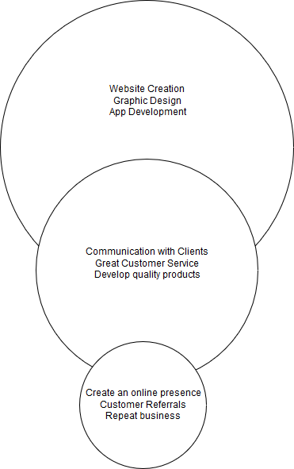

<h1>James Portzline's Professional Development</h1>
<h3>Career Buddy: Judah Medina-Armstrong</h3>
<h2>My Links</h2>
<embed src="Portzline James Resume.pdf" width="100%" height="600px" />
<a href="Portzline James Resume.pdf"/>Resume</a>
 
<a href="Indentity.pdf"/>Indentity</a>
 
<a href="https://www.linkedin.com/in/jamesportzline"/>Linkedin</a>
 
<a href="https://twitter.com/JamesPortzline?lang=en"/>Twitter</a>

<h2>Pro Dev Activities</h2>

<h3>My Learning Style</h3>

Hands on

20% Auditory

50% Hands on

30% Visual

<h3>Quantitative Accomplishments</h3>
 <ul>
     <li>Setup and mantained 200 school desktops</li>
     <li>Configured and deployed 90 ipads</li>
     <li>Developed 10 websites</li>
 </ul>
 
<h3>Qualitative Features</h3>
   <ul>
      <li>Self-starter</li>
      <li>Problem Solver</li>
      <li>Leader</li>
   </ul>

<h3>Whole Brain Paragraph</h3>
Music is one of my passions. Whether I’m practicing on playing on my guitar or finding new artists to listen to. Music can be used as the perfect background noise to any given situation and can set the mood. It helps me concentrate while working on a project, get into a serious gaming session, or allowing me to meditate while connecting to a spiritual plane.

<h3>Golden Circle</h3>

       
<h3>Elevator Pitch</h3>
Hello! My name James Portzline. I design graphics and websites for companies who need an online presence. Completed a website for a nutritionist who is helping people eat healthier. Do you have an online presence or website? 
  
 <h3>Visual Speak</h3>

My thoughts as to why I picked these 2 particular pictures. For the 1st pic, as I grow older and become complacent, and realize what I have learned a decade ago no longer applies to today’s demands for digital media. The advancement in the technology world whether it be the hardware and  more so tools in developing digital media will continue to evolve, and so should the skills needed as well. As for the 2nd picture, to quote an old phrase from Cervantes in Don Quixote “skies the limit”! I find myself wanting to develop and refine my current skill as well add new ones that will unlock new opportunities. 

<h2>Weekly Reflections</h2>

<h3>Week 1</h3>
My first week of boot camp has been exciting and fun. Meet 7 other people whom I will be getting to know over the 12 weeks. Four students including myself conceptualized, brainstormed, and developed a new boardgame which we are considering digitizing turning into a mobile game. Also, Rod has presented multiple projects to us for to possibly collaborate or do individually.

<h3>Week 2</h3>
Second week of Deep Dive Digital Media - Ryan, Anthony and I joined to work together on the AR project for Garcia Auto Group. Had a few guest speakers such as former students (alumni – cohort 1 of DDDM) speak and present current projects they are working on. Started working with Vyond developing a commercial for my wife and I. Also, jumped into Unity to get a head start.

<h3>Week 3</h3>

